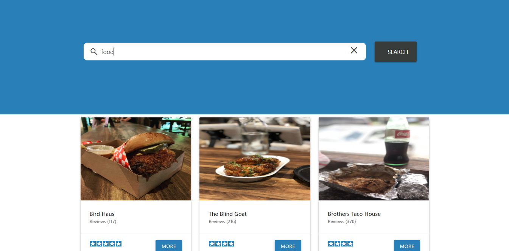
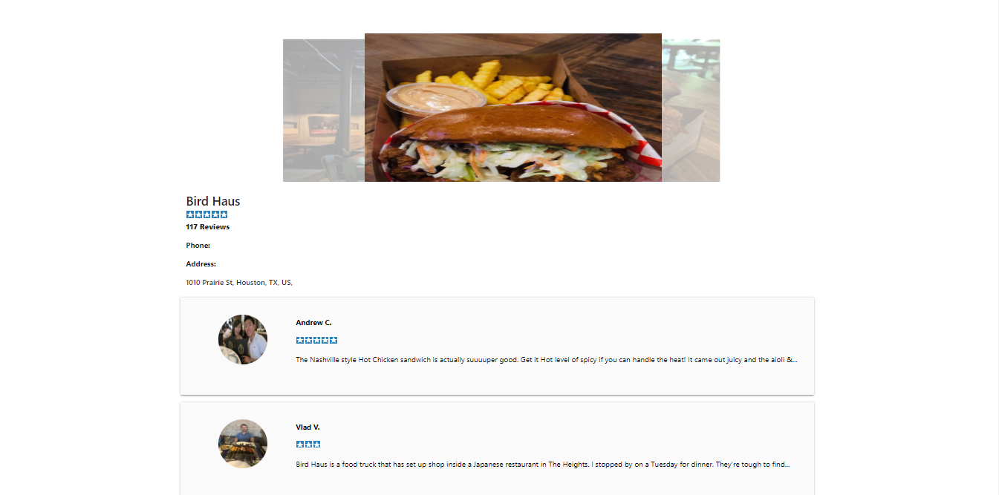

# YELP Dashboard

## React + Materialize CSS + Context API





>It uses your location to show businesses based on the keyword you enter unfortunately yelp dosn't work in some countries so you wont find any results so location can be manually set in BusinessState.js file.

# Usage

Replace "YOUR-YELP-SECRET" in .env file with your own key provided by Yelp API.

## Install Dependencies
```
npm install
```

## Run App
```
npm start
```

- Version 1.0.0
- License: MIT
